[](https://pepy.tech/project/graphql-schema-parse)
# graphql_schema_parse
> 解析GraphQL文档，并提供将其转成**.gql**(前端查询可用的query字符串)，**.json**(requests可用的json关键字参数接收数据)，**.txt**(sqlmap可用的扫描文件 --to sqlamp 支持的是 sqlmap -r 单接口, --to burp 支持的是sqlmap -l 多接口扫描)

## [GraphQL](https://graphql.cn/)
> GraphQL 既是一种用于 API 的查询语言也是一个满足你数据查询的运行时，详细内容点击标题访问官网
在实际工作种，最常用的是 query(查询), mutation(更改/新增), subscription

当发起一个GraphQL请求之后，通过抓包能够发现，最终和RESTFul发送请求没多大区别，它指定了JSON格式传参数，大致如下
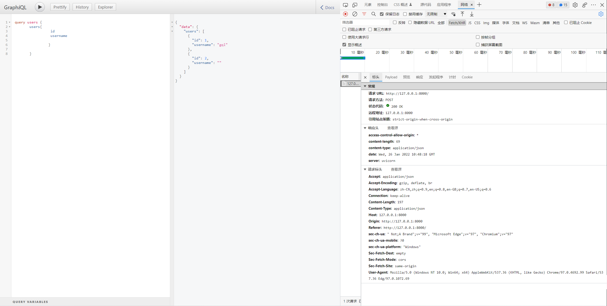
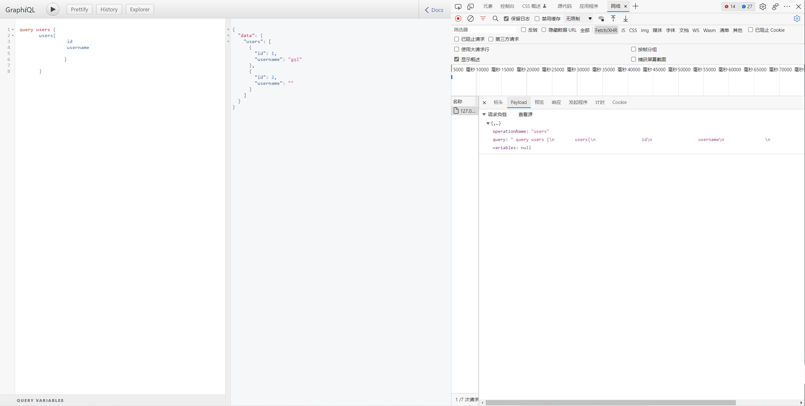
```json
{
  "query": " query users {\n        users{\n                  id\n                  username\n                 }\n             \n        }\n        ",
  "variables": {},
  "operationName": "users"
}
```
```json
{
  "query": "mutation addUser($username: String!, $password: String!) {\n  addUser(username: $username, password: $password) {\n    id\n    username\n  }\n}\n",
  "variables": {
    "username": "gql",
    "password": "gql1"
  },
  "operationName": "addUser"
}
```
```json
{
  "query": "mutation addUserInput($user: AddUserInput!) {\n  addUserInput(user: $user) {\n    id\n    username\n  }\n}\n",
  "variables": {
    "user": {
      "username": "haha",
      "password": "gg"
    }
  },
  "operationName": "addUserInput"
}
```

- query: 其实就是生成的查询部分语句，前端传字段后端定义有返回
- variables: 使用query语句中的变量名
- operationName: 则是后端在实现时指定的接口名称(暂时这么理解吧)
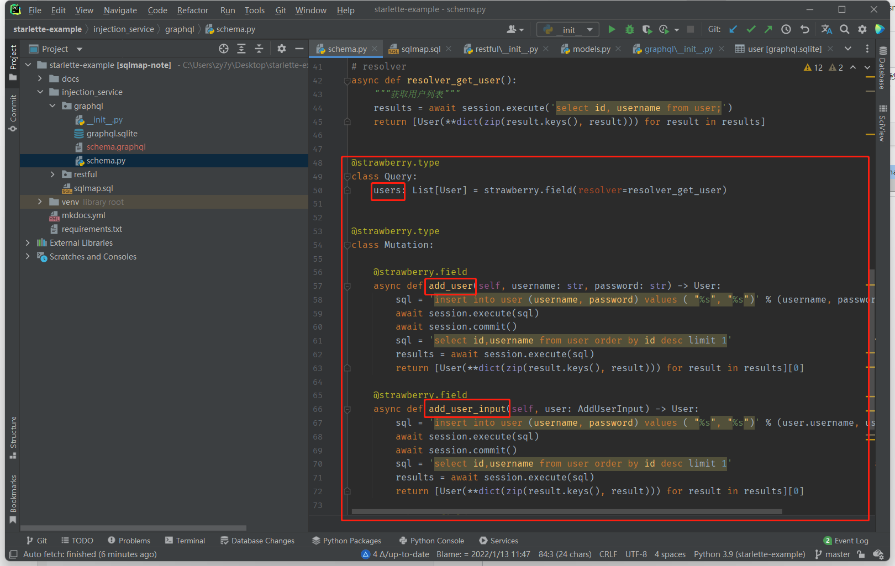
**这里用的Python语言，实际 `_` 会被转换成 `驼峰写法`**

## GraphQL示例应用
> 提供的GraphQL示例应用源码地址：https://gitee.com/zy7y/starlette-example
### 源码使用
1. 克隆
```shell
git clone https://gitee.com/zy7y/starlette-example
```
2. 安装依赖
```shell
pip install -r requirements.txt 
pip install strawberry-graphql[debug-server]
```
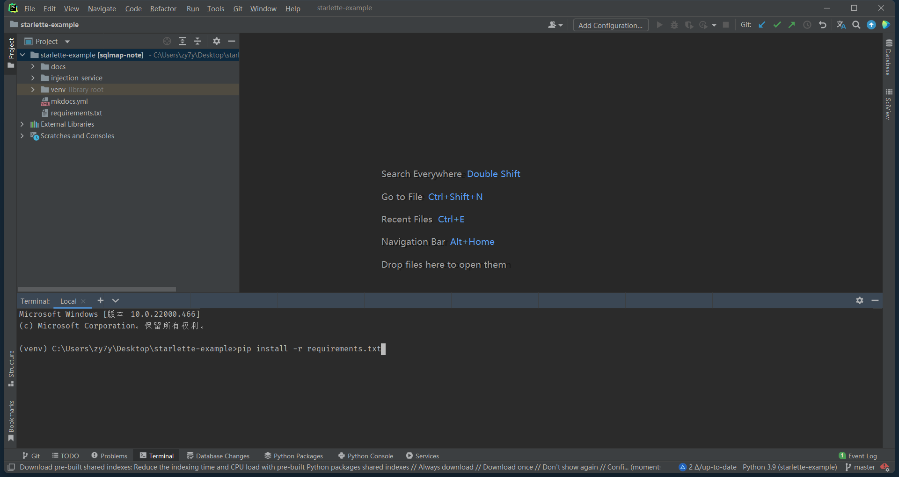
3. 启动
```shell
cd injection_service\graphql
strawberry server schema 
```
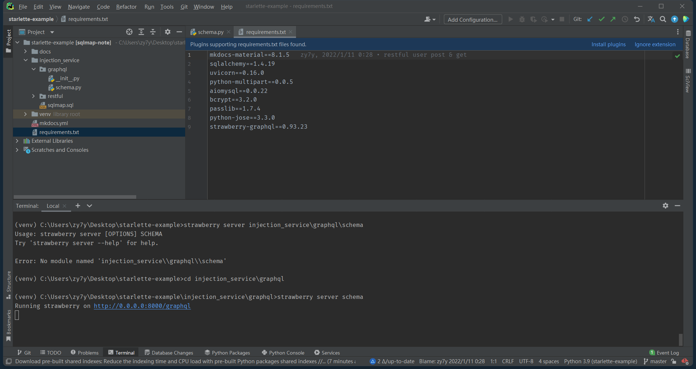
**访问：http://127.0.0.1:8000**
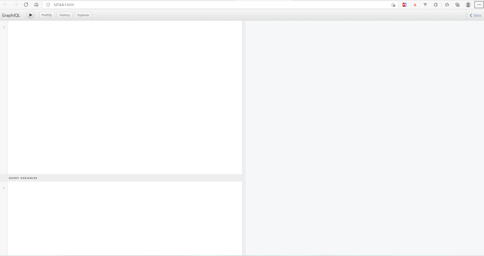
### 通过url获取接口文档
``` shell
# 转JSON
gql parse http://127.0.0.1:8000 目录地址

# 转GQL
gql parse http://127.0.0.1:8000 --to gql 目录地址

# 转sqlmap(-r HTTP请求信息.txt)
# 带json
gql parse http://127.0.0.1:8000 --headers .\examples\headers.json --to sqlmap .\examples\sqlmap（json）示例
# 不带json
gql parse http://127.0.0.1:8000 --to sqlmap .\examples\sqlmap示例
```
**需要Token认证**
```json5
// 新建headers.json 如下
{
"Authorization": "Bearer token"
}
```
```shell
gql parse http://127.0.0.1:8000 --headers headers.json 目录地址
```
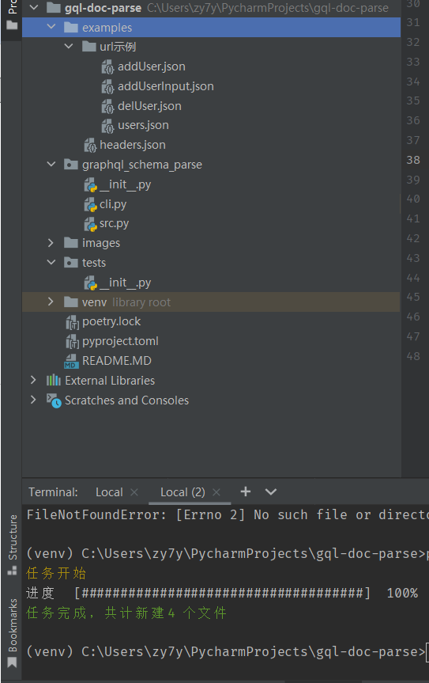
## 使用graphql-schema-parse
### 安装
```shell
pip install graphql-schema-parse
```

### 通过SDL获取接口文档
1. 前置条件
```shell
# 在执行启动服务相同目录下执行, 得到SDL
strawberry export-schema schema > schema.graphql
```
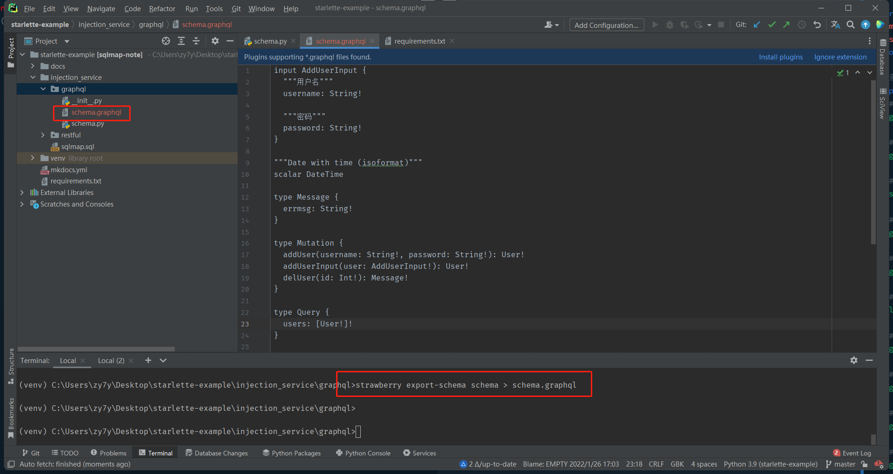
2. 通过graphql文件转换成gql
**sdl文件必须是utf-8编码，不是则自行修改**
```shell
gql parse examples\schema.graphql --to gql 目录地址
```
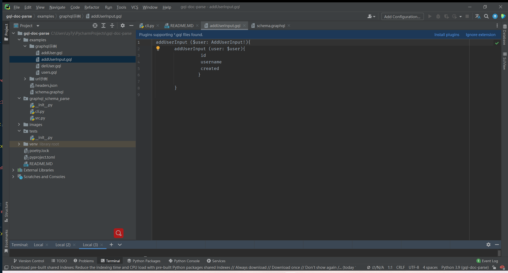

## 测试
1. gql文件(查询-query)
**将生成的users.gql 文件内容复制到127.0.0.1:8000当中**

2. gql文件(突变-mutation)
**将生成的addUser.gql 文件内容复制到127.0.0.1:8000当中**
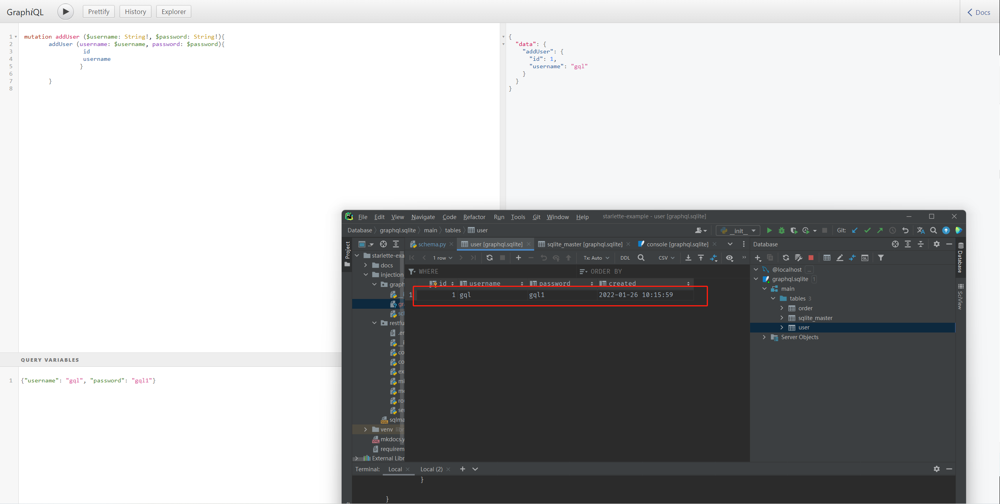
3. json文件(查询-query)
**将生成的users.json 文件内容赋值给`data`，使用requests包发送请求，代码如下**
```python
from requests import post

url = "http://127.0.0.1:8000/graphql"
data = {
    "query": " query users {\n        users{\n                  id\n                  username\n                 }\n             \n        }\n        ",
    "variables": {}, "operationName": "users"}
print(post(url, json=data).json())
```
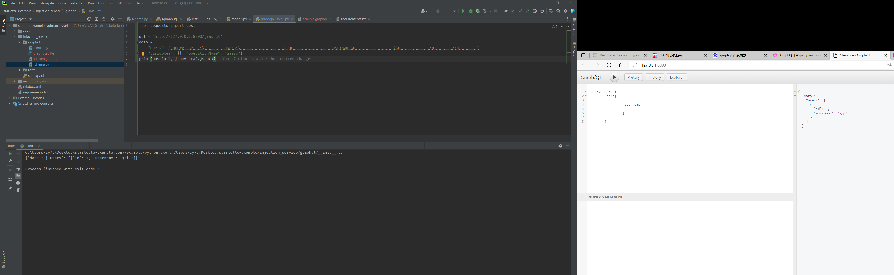
4. json文件(突变-mutation)
**将生成的addUsers.json 文件内容赋值给`data`，使用requests包发送请求，代码如下**
```python
from requests import post

url = "http://127.0.0.1:8000/graphql"
data = {
    "query": " mutation addUserInput ($user: AddUserInput!){\n        addUserInput (user: $user){\n                  id\n                  username\n                 }\n             \n        }\n        ",
    "variables": {"user": {"username": "", "password": ""}}, "operationName": "addUserInput"}
print(post(url, json=data).json())

```
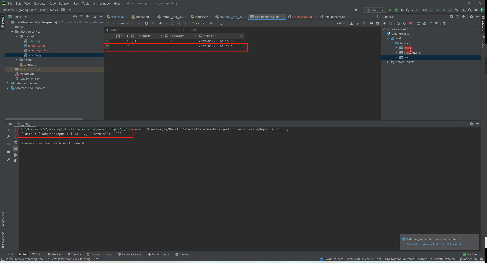
5. txt文件(sqlmap -r httpinfo.txt， 可用于sqlmap sql注入扫描)
**addUserInput.txt文件内容**
```text
POST /graphql HTTP/1.1
HOST: 127.0.0.1:8000
Authorization: Bearer token
Content-Type: application/json

{"query": " mutation addUserInput ($user: AddUserInput!){\n        addUserInput (user: $user){\n                  id\n                  username\n                 }\n             \n        }\n        ", "variables": {"user": {"username": "*", "password": "*"}}, "operationName": "addUserInput"}
```
```shell
# 安装sqlmap
pip install sqlmap

# 进行SQL注入扫描， sqlmap详细用法前往sqlmap官网学习
sqlmap -r addUserInput.txt --level 5 --risk 3
```
**扫描过程中**
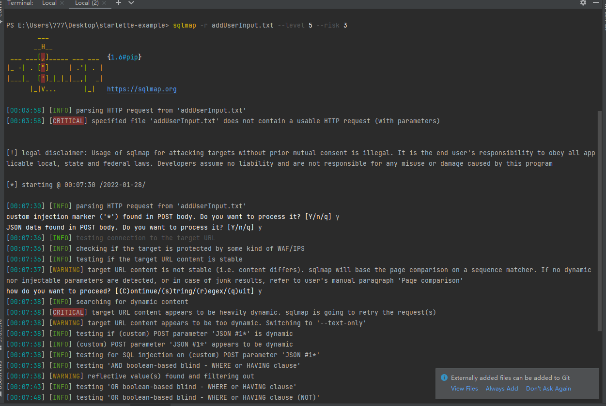
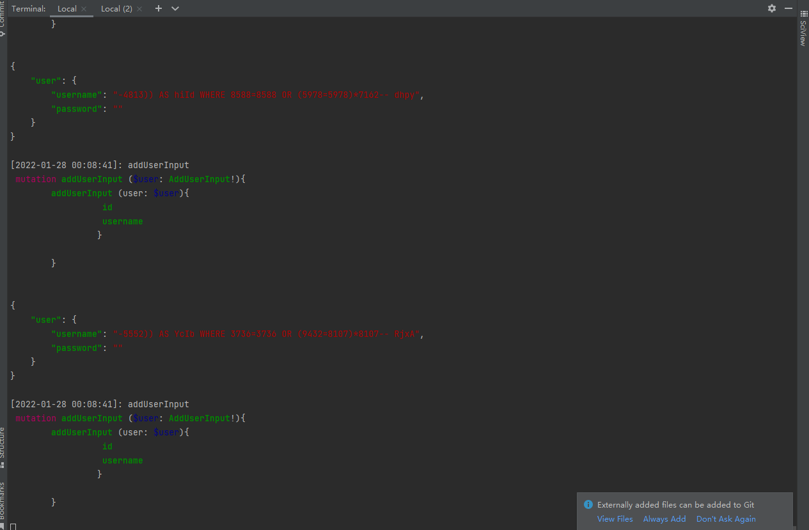
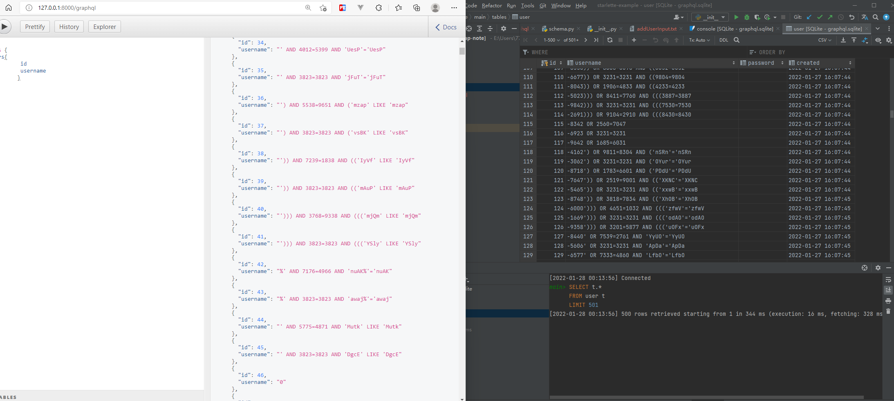
**扫描结果（获取到了我的数据库为SQLlite）**
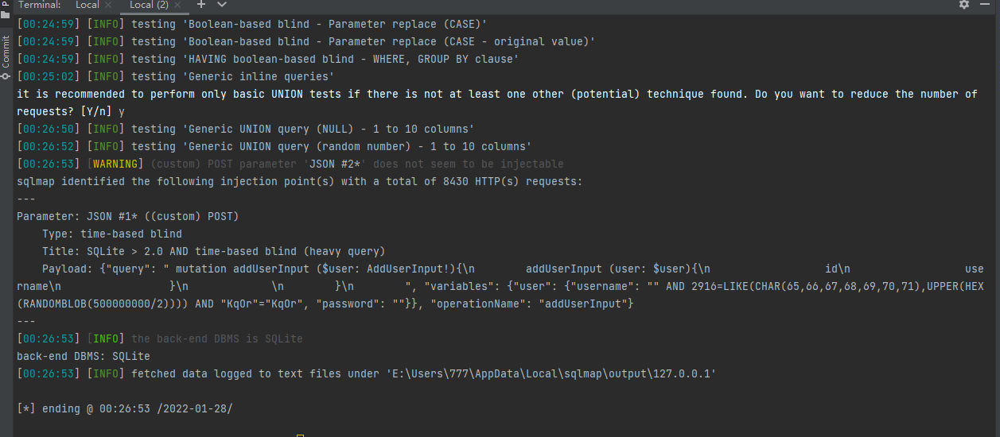
6. txt文件(sqlmap -l 可用的批量扫描文件)
```shell
gql  parse http://127.0.0.1:8000 --headers examples\headers.json --to burp demo1
```
```shell
# output demo1/burp.txt
==================================================================

==================================================================
POST /graphql HTTP/1.1
HOST: 127.0.0.1:8000
Authorization: Bearer token
Content-Type: application/json

{"query": " query users {\n        users{\n                  id\n                  username\n                 }\n             \n        }\n        ", "variables": {}, "operationName": "users"}
==================================================================

==================================================================

==================================================================
POST /graphql HTTP/1.1
HOST: 127.0.0.1:8000
Authorization: Bearer token
Content-Type: application/json

{"query": " mutation addUser ($username: String!, $password: String!){\n        addUser (username: $username, password: $password){\n                  id\n                  username\n                 }\n             \n        }\n        ", "variables": {"username": "*", "password": "*"}, "operationName": "addUser"}
==================================================================

==================================================================

==================================================================
POST /graphql HTTP/1.1
HOST: 127.0.0.1:8000
Authorization: Bearer token
Content-Type: application/json

{"query": " mutation addUserInput ($user: AddUserInput!){\n        addUserInput (user: $user){\n                  id\n                  username\n                 }\n             \n        }\n        ", "variables": {"user": {"username": "*", "password": "*"}}, "operationName": "addUserInput"}
==================================================================

==================================================================

==================================================================
POST /graphql HTTP/1.1
HOST: 127.0.0.1:8000
Authorization: Bearer token
Content-Type: application/json

{"query": " mutation delUser ($id: Int!){\n        delUser (id: $id){\n                  errmsg\n                 }\n             \n        }\n        ", "variables": {"id": 0}, "operationName": "delUser"}
==================================================================

```
**扫描结果**
```shell
# 扫描命令
sqlmap -l demo1\burp.txt  
```
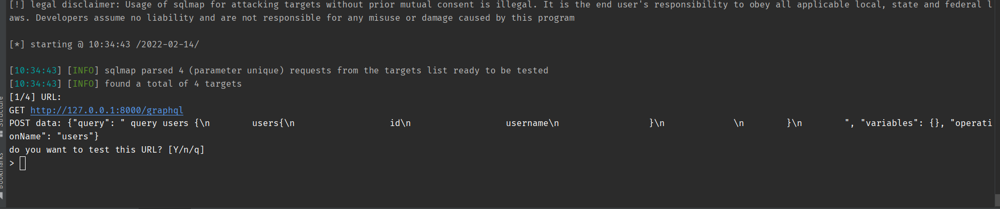
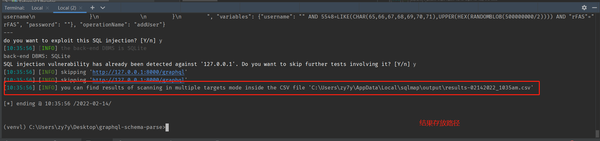
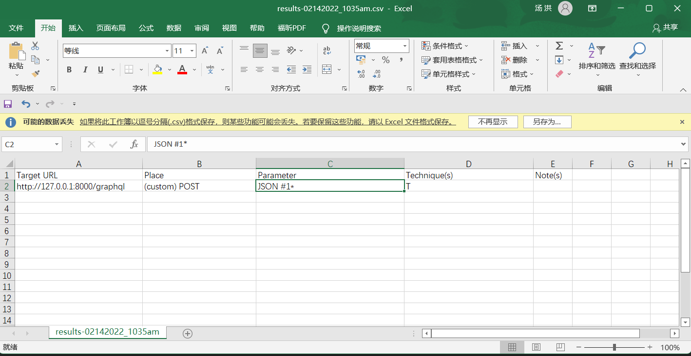

# 参数详情
```shell
gql parse --help 
```
output:
```shell
Usage: cli.py parse [OPTIONS] FROM_PATH TO_DIRECTORY

  将Graphql接口文档转成gql文件/Json文件 :param from_path: 接口文档地址, 本地JSON文件地址(.json) 或者 本地
  SDL文件(.schema ), 或者 服务器URL填入(服务器的IP:PORT) :param to: 转换之后的文件类型, 可选
  to_json(.json) / to_gql(.gql) / to_sqlmap(.txt)/ to_burp(.txt) :param
  headers: from_type 为url时可选项，请求头文件地址(.json) :param depth: query语句体中可用查询字段递归深度
  :param to_directory: 转换之后文件，保存目录 :return:

Arguments:
  FROM_PATH     接口文档地址, 本地JSON文件地址(.json) 或者 本地 SDL文件(.graphql ), 或者
                服务器URL填入(服务器的IP:PORT)  [required]
  TO_DIRECTORY  生成文件保存目录，不存在时，自动创建  [required]

Options:
  --headers TEXT               url方式获取接口文档时，可选项传入请求头json文件地址
  --to [json|gql|sqlmap|burp]  [default: ToType.to_json]
  --depth INTEGER              query语句体中可用查询字段递归深度  [default: 1]
  --help                       Show this message and exit.

```
